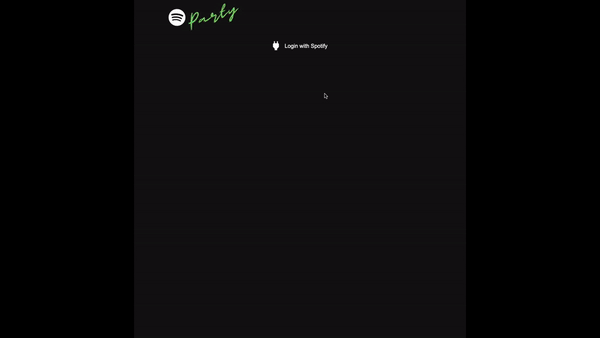

# Spotify Queue

This project is a result of numerous parties and frustration where a phone is passed around and people get to add their songs to the Spotify queue. Well, as it turns out the Spotify UI is just horrible to use by drunk people and their big fingers and more often than not the song is not added to the queue and instead the person accidentally presses play and then "Oh no, I didn't mean to do that!". This application only allows "add to queue" and that's it.

## Configuration

### Prerequisites

Go to https://developer.spotify.com and create a developer app which will provide you with a client ID. Detailed instructions [here](https://developer.spotify.com/documentation/web-api/tutorials/getting-started#create-an-app).

The developer app's Redirect URIs section should be populated with this:

```bash
http://localhost:5173/
http://localhost:5173/authorize
```

Add a `.env` file to the root of your project. Populate it with these variables:

```bash
VITE_SPOTIFY_CLIENT_ID=#get from developer.spotify.com
VITE_SPOTIFY_ACCOUNTS_URL=https://accounts.spotify.com
VITE_SPOTIFY_API_URL=https://api.spotify.com/v1
VITE_SPOTIFY_QUEUE_CLIENT_URL=http://localhost:5173
NODE_ENV=development
```

### Install

```bash
npm i
```

### Run

Start a development server with _hot_ module replacement

```bash
npm start
```

### Build

```bash
npm run build
```

## Usage

You must have a Spotify premium account.

1. Open Spotify
2. Go to http://localhost:5173
3. Login with Spotify credentials
   3.1 If you have more than one Spotify app running (in different devices), select your desired device from the provided list after login
   3.2 After login you will be prompted to start Spotify on your machine

4. On the search view, enter a search query to the input field
5. To add a song to the queue use the 3 dot menu button and click "Add to queue" and get a notification


